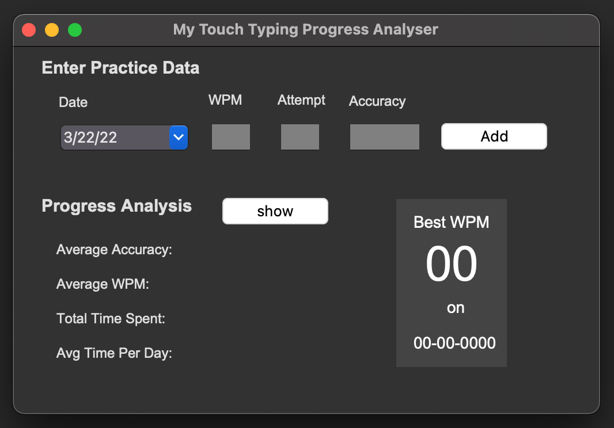
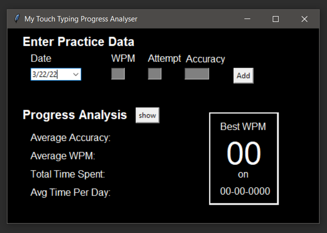

# Touch Typing Progress

This code is developed to keep track me practicing touch typing. The code is tested on both Windows 10 and macOS Big Sur.

#### Steps to Run
1. Make sure you have Python 3 installed on your computer.
2. Change the current directory (cd) to where requirements.txt is located.
3. Run: `pip install -r requirements.txt` in your shell.
4. Then run `python GUI_Prog.py`. Alternatively, you can open the project in a preferred IDE (e.g. PyCharm) and run GUI_Prog.py 

#### How to use the program

> Note: I am using [10 Fast Fingers](https://10fastfingers.com/typing-test/english) website to practice touch typing and enter the data using this program. 
> As mentioned above this is jsut a fun project. Once you enter the data it will create `touchTypingProgress.csv` file with which bear your practice data. 

1. Enter your practice data on the provided GUI (see the attached figure below).
2. Date will be automatically filled (You can also click on the down arrow and pick a date from the date picker).
3. Enter Word Per Minute (WPM) value, attempt count per daay (i.e. each day first attempt is number 1, second attempt is 2 etc.), then the accuracy of you typing (e.g., 98.78), then hit `Add` button.
4. This will show a message if the data is successfully added to the CSV file.
5. Click `Show` button to see some basic statistics of your progress.

[comment]: <> (![img_macos.png]&#40;images/img_macos.png&#41;)

[comment]: <> (![img_windows.png]&#40;images/img_windows.png&#41; )

